# Lead Generation – Research Profile Extraction Demo

## Project Overview

This application demonstrates an AI-powered lead generation system designed to identify, enrich, and rank research profiles from scientific abstracts. Built as a demo for a lead-generation assignment, the system automates the discovery of qualified researchers based on domain-specific research topics.

**Problem Statement:** Manually identifying relevant research professionals from scientific literature is time-consuming and inconsistent. This system uses natural language processing to extract structured researcher profiles and applies intelligent scoring to prioritize the most relevant contacts.

## System Workflow

The application implements a three-stage pipeline:

### Stage 1: Identification
- User selects a research focus area (e.g., Drug-Induced Liver Injury, 3D Cell Culture, Toxicology)
- System loads pre-curated scientific abstracts matching the selected topic
- Abstracts are prepared for information extraction

### Stage 2: Enrichment
- Large Language Models (LLM) analyze each abstract to extract structured researcher profiles
- Extracted data includes: researcher name, title, affiliation, location, email, and research keywords
- Fallback model ensures robustness if primary extraction fails

### Stage 3: Ranking
- Each profile is scored using a weighted algorithm across four criteria:
  - **Role/Seniority** (30 points): Professor, PI, Director roles rank higher
  - **Publication Recency** (40 points): Recent publications indicate active research
  - **Research Relevance** (20 points): Keyword alignment with selected topic
  - **Geographic/Institutional Fit** (10 points): Location and affiliation considerations
- Profiles are ranked by total score in descending order
- Users can filter and export results

## Data Source

The application uses **curated scientific abstracts** that mirror PubMed structure for demonstration purposes. The demo dataset includes 9 realistic research abstracts across 3 research domains.

**Architecture Note:** The system is designed with data abstraction in mind. Live PubMed (NCBI E-utilities) integration can be added without modifying core extraction, scoring, or ranking logic. The modular architecture allows seamless transition from static demo data to real-time PubMed queries.

## Extraction Details

The LLM extraction pipeline automatically identifies and structures the following information from each abstract:

- **Researcher Name** – First and last name of corresponding authors
- **Role/Title** – Position (e.g., Professor, Postdoctoral Researcher, Senior Scientist)
- **Affiliation** – Institution or organization name
- **Location** – City/country of the researcher's primary institution
- **Email** – Contact email (when available in abstract metadata)
- **Research Keywords** – Topic areas and methodologies mentioned
- **Research Summary** – Concise description of the researcher's work

## Scoring & Ranking Logic

Profiles are ranked using a deterministic scoring algorithm (max 100 points):

| Criterion | Points | Rationale |
|-----------|--------|-----------|
| Role Seniority | 30 | Senior researchers (PI, Professor, Director) have higher lead quality |
| Publication Recency | 40 | Active publication within last 5 years indicates current engagement |
| Research Keywords | 20 | Direct keyword alignment with selected research focus |
| Location/Institution | 10 | Bonus for institutional prestige or target geographic location |

Scores are calculated deterministically for consistency and used to rank all profiles. This allows users to prioritize outreach based on researcher quality metrics.

## User Interface

The Streamlit-based interface provides:

- **Research Topic Selection** – Dropdown menu to choose research area
- **Extract & Rank Button** – Initiates profile extraction and scoring
- **Results Dashboard** – Displays total profiles extracted, average score, and top score
- **Ranked Profiles Table** – Shows all profiles sorted by score with columns:
  - Rank, Score, Name, Title, Company, Location, Email, LinkedIn, Keywords
- **Filtering Options**:
  - Filter by researcher name
  - Filter by location
  - Minimum score threshold
- **Export Functionality**:
  - Download all profiles as Excel
  - Download filtered profiles as Excel

## Technology Stack

| Component | Technology |
|-----------|-----------|
| **Frontend** | Streamlit (Python web framework) |
| **LLM - Primary** | OpenAI GPT-4o |
| **LLM - Fallback** | Google Gemini 2.5 Flash |
| **Backend** | Python 3.11+ |
| **Data Format** | JSON (abstracts), Excel (export) |
| **Data Processing** | Pandas, openpyxl |
| **API Integration** | LangChain |

## Limitations & Future Enhancements

### Current Limitations
- **Static Demo Data**: Currently uses pre-curated abstracts; not real-time data
- **Extraction Accuracy**: LLM performance depends on abstract quality and structure
- **Limited to 2 LLM Providers**: OpenAI and Gemini only; others can be added

### Planned Enhancements
- **PubMed API Integration**: Real-time abstract fetching using NCBI E-utilities
- **Advanced Lead Scoring**: Customizable weighting per research domain
- **RAG Support**: Retrieve and rank based on full-text paper analysis
- **Batch Processing**: Multi-keyword analysis and comparative ranking
- **Database Integration**: Persist extracted profiles for duplicate detection and historical tracking

## System Architecture

```mermaid
graph TB
    User["👤 User Interface<br/>(Streamlit UI)"]
    Keyword["🔍 Keyword Selection<br/>(Research Topic)"]
    DataLoader["📂 Data Loader<br/>(sample_abstracts.json)"]
    LLM{"🤖 LLM Pipeline"}
    OpenAI["OpenAI GPT-4o<br/>(Primary)"]
    Gemini["Google Gemini<br/>(Fallback)"]
    Extractor["📝 LLM Extractor<br/>(profile extraction)"]
    Scorer["⭐ Profile Scorer<br/>(4 weighted criteria)"]
    Filter["🔎 Filter & Sort<br/>(name, location, score)"]
    Excel["📊 Excel Export<br/>(openpyxl)"]
    Output["💾 Download Results<br/>(Excel file)"]
    
    User --> Keyword
    Keyword --> DataLoader
    DataLoader --> Extractor
    Extractor --> LLM
    LLM -->|Success| OpenAI
    LLM -->|Fallback| Gemini
    OpenAI --> Scorer
    Gemini --> Scorer
    Scorer --> Filter
    Filter --> Excel
    Excel --> Output
    Output --> User

    style User fill:#e1f5ff
    style Keyword fill:#fff3e0
    style DataLoader fill:#f3e5f5
    style LLM fill:#fce4ec
    style OpenAI fill:#e8f5e9
    style Gemini fill:#e8f5e9
    style Extractor fill:#f1f8e9
    style Scorer fill:#ffe0b2
    style Filter fill:#f0f4c3
    style Excel fill:#c8e6c9
    style Output fill:#b3e5fc
```



## How to Run

### Prerequisites
- Python 3.11 or higher
- `uv` package manager ([install uv](https://docs.astral.sh/uv/))
- API keys for OpenAI and/or Google (set in `.env` file)

### Quick Start with `uv`

1. **Clone the repository**
   ```bash
   git clone https://github.com/saikiranpulagalla/research-lead-generation-demo.git
   cd research-lead-generation-demo
   ```

2. **Create virtual environment with uv**
   ```bash
   uv venv
   source .venv/bin/activate  # On Windows: .venv\Scripts\activate
   ```

3. **Install dependencies with uv**
   ```bash
   uv sync
   ```

4. **Set up API keys**
   Create a `.env` file in the project root:
   ```env
   OPENAI_API_KEY=your_openai_api_key_here
   GOOGLE_API_KEY=your_google_api_key_here
   ```

### Alternative: Traditional pip Setup

If you prefer traditional Python setup:

   ```bash
   git clone https://github.com/saikiranpulagalla/research-lead-generation-demo.git
   cd research-lead-generation-demo
   python -m venv venv
   source venv/bin/activate  # On Windows: venv\Scripts\activate
   pip install -r requirements.txt
   ```

### Running the Application

Start the Streamlit application:
```bash
streamlit run app/streamlit_app.py
```

The app will open at `http://localhost:8501`

### Running Tests

Execute the test suite:
```bash
pytest tests/ -v
```

## Project Structure

### Essential Files Only

```
research-lead-generation-demo/
├── app/
│   ├── streamlit_app.py              # Main Streamlit UI
│   └── pipeline/
│       ├── model_selector.py         # LLM model selection logic
│       ├── extractor.py              # LLM extraction engine
│       ├── scoring.py                # Profile scoring algorithm
│       └── excel_writer.py           # Excel export handler
├── data/
│   └── sample_abstracts.json         # Demo dataset (9 abstracts, 3 keywords)
├── .env.example                      # Example environment variables
├── pyproject.toml                    # Project metadata & dependencies (uv)
├── requirements.txt                  # Python dependencies (pip)
└── README.md                         # This file
```

**Note:** Non-essential files (test configs, legacy modules, pycache) are removed for a clean, production-ready structure.

## Notes

- The application gracefully handles LLM failures by falling back to a secondary model
- All extracted data is processed locally; no profiles are stored without explicit export
- Scoring algorithm is reproducible and deterministic for consistent ranking

---

**Status:** Demo Application | Lead Generation Assignment | v1.0
